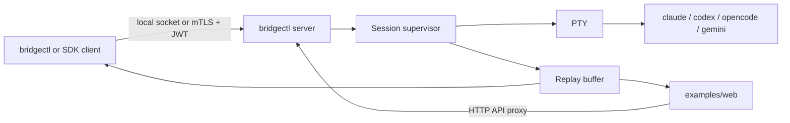

AI Agent Bridge runs AI agent CLIs as supervised PTY sessions and exposes them through a local or remote gRPC API. A client can start a session, attach as a writer or observer, replay buffered output, send terminal input, resize the PTY, and stop the session.

Supported providers are `claude`, `codex`, `opencode`, and `gemini`.

## Common Paths

- Start one server on your current machine: [Local server quick start](getting-started/local-server)
- Use the browser UI to start and watch sessions: [Web UI guide](guides/web-ui)
- Run a Step CA and connect machines over Tailscale: [Step CA over Tailscale](guides/step-ca-tailscale)
- Look up CLI commands and flags: [CLI reference](reference/cli)
- Tune provider, session, auth, and path policy: [Configuration reference](reference/configuration)

## Runtime Model

`bridgectl server start` is the main runtime. It is intentionally a user-session server, not a system daemon. Agent CLIs often need access to the operator's home directory, provider auth files, display server variables, and checked-out repositories. Running as the login user preserves that environment.

Local clients use a Unix socket when the server is started without `--listen`. Remote clients use TCP with mTLS and JWT when the server is started with `--listen`, usually on a private network such as Tailscale.

## Security Model

Remote access has two required layers:

- mTLS proves the client and server certificate identities.
- JWT proves application identity and is verified against registered Ed25519 public keys.

For a single developer, the bridge can generate local PKI automatically. For more than one machine, use Step CA over Tailscale so server and client certificates are issued by a shared CA.
