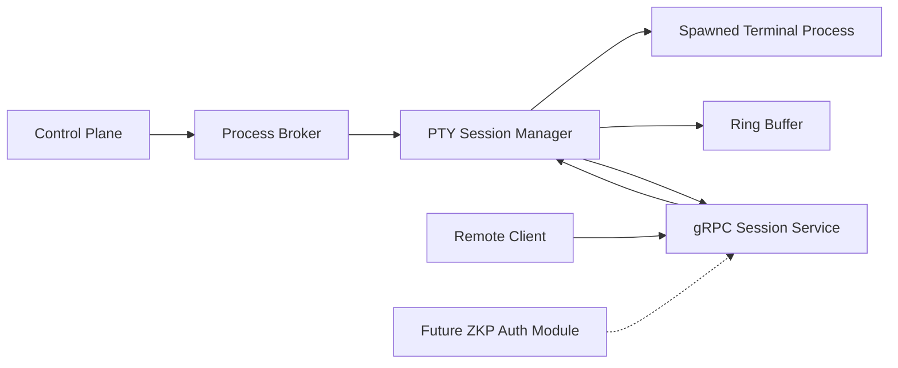
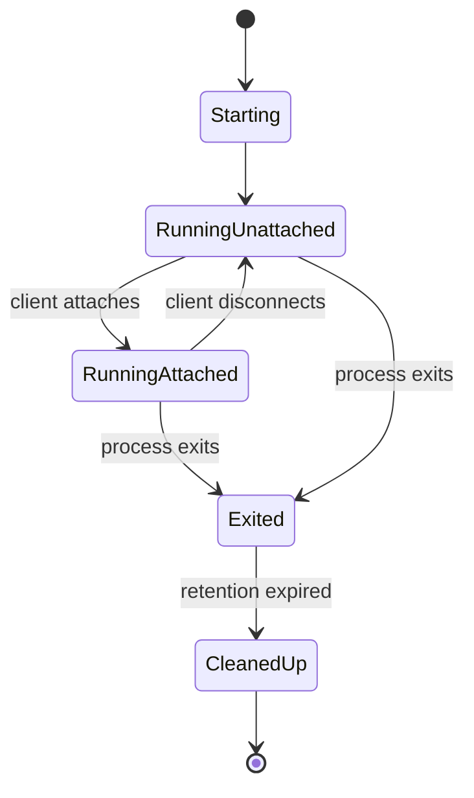

# Remote PTY Broker Design

## Overview

This document describes a low-level Golang system that starts a terminal application inside a pseudo-terminal, captures its output, stores that output in a bounded ring buffer, and allows a single remote client to attach over gRPC.

The remote client can:

- receive buffered output produced before it connected
- switch to live output streaming after replay
- send user input back to the running process
- send terminal resize events

This system is intended to be the transport layer for a higher-level control plane. It focuses on process startup, session lifecycle, PTY I/O, buffering, and one-client remote control. Authentication is left intentionally minimal, with a defined placeholder for a future zero knowledge proof authentication system.

## Goals

- Start a terminal application on a host machine inside a PTY
- Capture raw PTY output as bytes, not parsed lines
- Store recent PTY output in a bounded ring buffer
- Allow a client to connect after process startup and replay buffered output
- Allow exactly one active client connection at a time
- Forward client input bytes into the PTY
- Forward window resize events into the PTY
- Preserve enough session metadata to support reconnects and post-exit inspection
- Leave a clear integration point for future ZKP-based authentication

## Non-Goals

- Multi-client collaboration
- Shared cursor ownership
- Rich session recording playback controls
- Full screen-state reconstruction on the server
- File transfer
- Browser terminal rendering
- Terminal protocol normalization across platforms
- Implementation of the zero knowledge proof authentication system in this phase

## Core Design Choice

The system will operate as a **PTY byte-stream transport**, not as a server-side terminal renderer.

That means:

- the server reads raw bytes from the PTY
- the server stores those bytes in a ring buffer
- the server replays those bytes to a late-connecting client
- the client is responsible for terminal rendering

This keeps the server simple and reliable. It also preserves compatibility with interactive terminal applications that depend on ANSI escape sequences, cursor movement, alternate screen buffers, and redraw behavior.

## High-Level Architecture



## Main Components

### 1. Process Broker

The Process Broker is responsible for:

- receiving a request from the control plane to start a process
- generating a session ID
- creating a PTY-backed process session
- tracking process lifecycle state
- exposing session metadata to the rest of the system

### 2. PTY Session Manager

The PTY Session Manager owns the runtime state of a single remote process session.

Responsibilities:

- start the child process inside a PTY
- read PTY output continuously
- append output into the ring buffer
- deliver live output to the currently attached client
- accept input bytes from the client and write them into the PTY
- apply resize events
- track process exit code and timestamps
- enforce single-client attachment rules

### 3. Ring Buffer

The ring buffer stores recent PTY output in bounded memory.

Responsibilities:

- append output chunks in order
- assign sequence numbers
- drop oldest chunks when capacity is reached
- support replay from the oldest retained chunk
- support replay from a client-provided sequence number if still available

The ring buffer stores raw PTY bytes, not screen snapshots.

### 4. gRPC Session Service

The gRPC service provides the transport protocol between the server and the remote client.

Responsibilities:

- allow the client to attach to a session
- stream output bytes to the client
- receive input bytes and resize events from the client
- reject additional clients if one is already attached
- expose process status and exit information

### 5. Future ZKP Auth Module

A placeholder authentication layer will sit in front of session attachment and control operations.

It will eventually verify the client's proof of authorization before allowing:

- session discovery
- session attachment
- input control
- reconnection

For this phase, the design only reserves the interface boundary.

## Session Lifecycle

### 1. Session Creation

1. The control plane asks the broker to start a terminal process.
2. The broker creates a new session ID.
3. The broker starts the process inside a PTY.
4. The session manager begins reading PTY output immediately.
5. PTY output is written into the ring buffer whether or not a client is attached.
6. The process may run unattended and may block waiting for input.

### 2. Client Attachment

1. The client requests attachment to the session over gRPC.
2. The auth placeholder is invoked.
3. The server verifies there is no currently attached client.
4. The server replies with session metadata.
5. The server replays the retained output from the ring buffer.
6. The server switches the client into live streaming mode.
7. The client may now send input and resize events.

### 3. Active Interaction

- PTY output continues to flow into the ring buffer
- live output is forwarded to the connected client
- client keystrokes are written into PTY stdin
- resize events adjust PTY dimensions
- heartbeats detect broken connections

### 4. Disconnect

If the client disconnects:

- the process continues running
- PTY output continues to be buffered
- the session returns to an unattached state
- another client may attach later
- input is not accepted until a new client attaches

### 5. Process Exit

If the process exits:

- the exit code is recorded
- the final output remains available in the ring buffer until session cleanup
- a later client may attach in read-only inspection mode if retained
- the session eventually expires and is cleaned up

## Why the Ring Buffer Matters

A late client may connect minutes after process startup. During that time the process could:

- print banners or prompts
- display setup logs
- wait for a password or confirmation
- enter a full-screen terminal mode
- emit errors and then idle

The ring buffer solves the late-attach problem by preserving recent PTY output. When the client connects, it receives the buffered output in order, then transitions into live mode.

This does not guarantee infinite history. It guarantees only the most recent output that fits within the configured retention window.

## Ring Buffer Design

## Buffer Model

The server stores output as ordered chunks:

- `seq`: monotonically increasing sequence number
- `timestamp`
- `payload`: raw PTY bytes

Example chunk:

```text
seq=1842
timestamp=2026-03-30T09:12:14Z
payload=[raw bytes]
```

## Capacity

Use a bounded capacity based on total bytes, not message count.

Example starting point:

- 8 MB to 64 MB per session, configurable

This works better than a fixed number of chunks because terminal output sizes vary widely.

## Behavior When Full

When the ring buffer reaches capacity:

- oldest chunks are evicted
- newest output is always retained
- the oldest retained sequence number advances

If a client asks to replay from a sequence number that has already been evicted, the server should respond with a replay-gap error and require replay from the oldest available chunk.

## Replay Strategy

When a client attaches:

- the server snapshots the current readable range of the buffer
- the server sends replay chunks in sequence order
- once replay reaches the current tail, the session switches to live forwarding

To avoid race conditions, the server should define a replay boundary before sending buffered data and then continue from that boundary into live mode.

## Single-Client Policy

Only one active client can be attached at a time.

Rules:

- one session can have at most one controlling client connection
- if a second client attempts to attach while one is active, the server rejects it
- once the active client disconnects or times out, another client may attach
- no observer mode is included in this version

This reduces complexity and avoids conflicting input streams.

## Waiting for Input

If the process asks for input before a client connects, the process will block in the PTY.

That is acceptable for this design.

Expected behavior:

- the prompt output is buffered
- the late client connects
- the buffered prompt is replayed
- the client provides input
- the process resumes

This matches the intended operating model: the app will pause soon enough and wait for remote input.

## Process Model

Each spawned process runs in a PTY rather than with plain pipes.

Why PTY instead of stdout and stdin pipes:

- many terminal apps change behavior when not attached to a TTY
- prompts, raw mode, curses, and readline often require a PTY
- terminal resize support depends on PTY semantics

Recommended Go library:

- `github.com/creack/pty`

## gRPC API Shape

Use a bidirectional streaming RPC for the interactive session.

### Proposed service

```proto
service RemoteSessionService {
  rpc Attach(stream ClientMessage) returns (stream ServerMessage);
}
```

### Client messages

```proto
message ClientMessage {
  oneof body {
    AttachRequest attach = 1;
    InputChunk input = 2;
    ResizeEvent resize = 3;
    Ack ack = 4;
    Heartbeat heartbeat = 5;
    DetachRequest detach = 6;
  }
}
```

### Server messages

```proto
message ServerMessage {
  oneof body {
    AttachAccepted attached = 1;
    ReplayChunk replay = 2;
    LiveOutputChunk output = 3;
    ProcessExited exited = 4;
    ErrorMessage error = 5;
    Heartbeat heartbeat = 6;
  }
}
```

### Attach request

```proto
message AttachRequest {
  string session_id = 1;
  uint64 resume_from_seq = 2;
  AuthEnvelope auth = 3;
}
```

### Output chunk

```proto
message LiveOutputChunk {
  uint64 seq = 1;
  bytes payload = 2;
  int64 unix_nano = 3;
}
```

### Replay chunk

Replay and live output can be the same wire type if preferred. Keeping them separate makes debugging easier.

### Resize event

```proto
message ResizeEvent {
  uint32 cols = 1;
  uint32 rows = 2;
}
```

### Exit event

```proto
message ProcessExited {
  int32 exit_code = 1;
  int64 exited_at_unix_nano = 2;
}
```

## Auth Placeholder for Future ZKP Integration

Authentication is not implemented in this version, but the interface must be reserved.

### Placeholder structure

```proto
message AuthEnvelope {
  string scheme = 1;
  bytes payload = 2;
}
```

Expected near-term behavior:

- `scheme` may be `"none"` or `"placeholder"`
- server passes the envelope into an auth interface
- default implementation allows or denies based on control plane policy

### Future integration point

Later, this can become:

- proof verification against a challenge
- authorization bound to a session ID
- authorization scoped to attach versus control rights
- replay protection and nonce validation

### Interface sketch in Go

```go
type Authenticator interface {
    VerifyAttach(ctx context.Context, sessionID string, env AuthEnvelope) error
}
```

This keeps auth decoupled from session transport.

## Server State Model



## In-Memory Session Structure

Suggested Go shape:

```go
type Session struct {
    ID              string
    Command         []string
    StartedAt       time.Time
    ExitedAt        *time.Time
    ExitCode        *int
    PTYFile         *os.File
    Cmd             *exec.Cmd

    Buffer          *RingBuffer
    NextSeq         uint64

    AttachedClient  *ClientHandle
    AttachMu        sync.Mutex

    Status          SessionStatus
    LastHeartbeat   time.Time

    Authenticator   Authenticator
}
```

## Concurrency Model

Recommended goroutines per session:

- one goroutine to read from the PTY and append to the ring buffer
- one goroutine to wait for process exit
- one goroutine bound to the active gRPC stream
- optional heartbeat watchdog goroutine

Synchronization points:

- mutex around client attachment state
- ring buffer internal lock or lock-free structure
- atomic sequence number increment
- context cancellation for stream shutdown

## Reconnect Behavior

Because the system stores sequence-numbered chunks, a reconnecting client can request:

- full replay from the oldest retained chunk
- replay from the last sequence number it successfully rendered

If the requested sequence number is no longer in the ring buffer, the server should return a replay-gap error and let the client decide whether to start from the oldest retained chunk.

## Error Handling

### Attach rejection

Reasons to reject attachment:

- session not found
- session expired
- another client is already attached
- auth failed
- requested replay point is invalid

### Stream interruption

If the client stream breaks:

- mark the session as unattached
- continue buffering output
- keep the process alive unless control plane policy says otherwise

### PTY failure

If PTY reads fail unexpectedly:

- record the failure
- notify the client if attached
- terminate the process if necessary
- mark the session as failed or exited

## Security Considerations

Even before ZKP auth is added, treat this system as security-sensitive.

Minimum controls:

- require TLS for gRPC transport
- ensure session IDs are unguessable
- deny concurrent attachments
- separate session creation authority from session attachment authority
- log attach, detach, replay, and input-control events
- add idle timeouts for orphaned sessions

Future controls:

- ZKP-based authentication
- per-session capability tokens
- challenge-response attach flow
- signed control-plane-issued attach grants

## Observability

At minimum, capture:

- session created count
- session attach success and failure count
- attach duration
- replay byte count
- live output byte count
- input byte count
- disconnect count
- process exit count
- buffer eviction count
- current attached sessions
- current unattached sessions

Useful logs:

- session start
- session attach attempt
- session attach accepted
- session attach rejected
- client disconnect
- replay gap encountered
- process exit

## Cleanup Policy

Sessions should not live forever.

Suggested policy:

- running unattached sessions remain alive until process exit or control plane timeout
- exited sessions remain inspectable for a short retention period
- ring buffer memory is freed on cleanup
- PTY resources are always closed during cleanup

## Suggested Initial Implementation Plan

### Phase 1

- start PTY-backed process
- read PTY output
- implement bounded ring buffer
- implement single-client gRPC attach
- replay retained output on attach
- stream live output
- send client input and resize events
- capture exit code

### Phase 2

- reconnect by sequence number
- metrics and structured logs
- cleanup worker
- control plane hooks

### Phase 3

- auth placeholder implementation
- attach policy enforcement
- future ZKP auth adapter

## Tradeoffs

### Why not keep full history forever

Full history makes memory usage unbounded and turns the transport into an archival system. The ring buffer keeps this layer lean.

### Why not compute server-side screen state

That would improve late-join experience for some TUIs, but it adds terminal emulation complexity to the server. The byte-stream model is simpler and more robust.

### Why only one client

One client removes input contention and simplifies ownership, replay, locking, and policy.

## Open Questions

- Should a client be allowed to attach after process exit for read-only playback?
- How long should exited sessions be retained?
- Should the control plane be able to force-detach a stuck client?
- Should the server kill a process after a long unattached idle period?
- Should replay be all retained output or only from a requested sequence number?

## Recommendation

Build the first version as a focused PTY session broker with:

- `creack/pty` for PTY support
- gRPC bidirectional streaming for transport
- a byte-based bounded ring buffer
- single-client attach enforcement
- a clean auth interface that currently acts as a placeholder
- no attempt at server-side screen rendering

This gives you a solid low-level foundation for the control plane while keeping the runtime behavior correct for real terminal applications.
